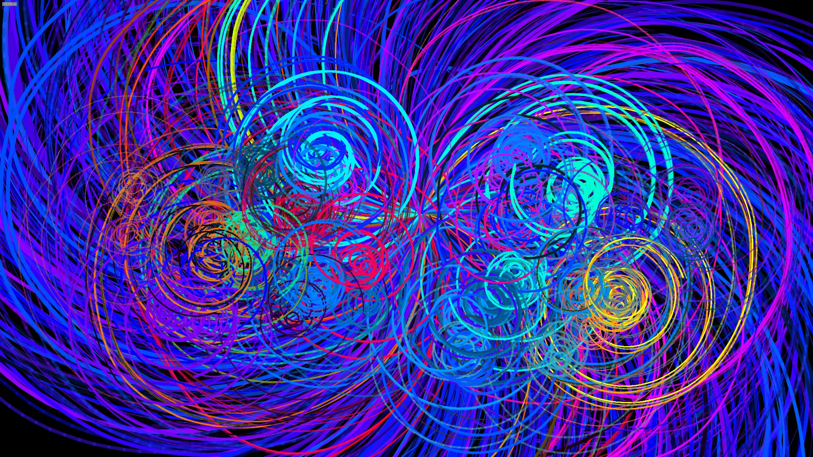

# ColorRhapsody
Color Rhapsody is a computational art project that has many modes, each using randomized parameters to generate beautiful linear artworks.

Demo:
-----

More can be found on https://www.jimmyshan.com/single-post/2018/02/27/Computational-Art-Color-Rhapsody

Package:
--------
* Processing 3.3
* controlP5 library

